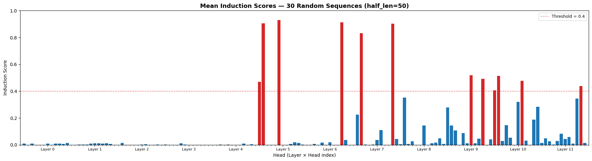
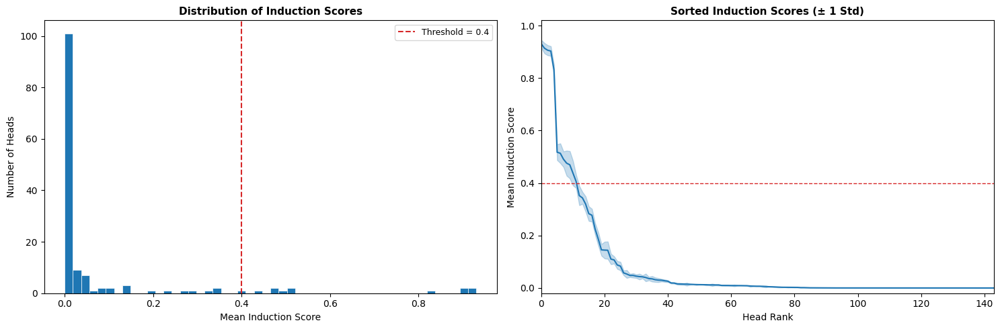
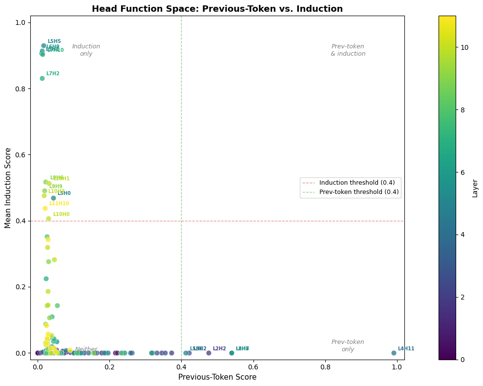
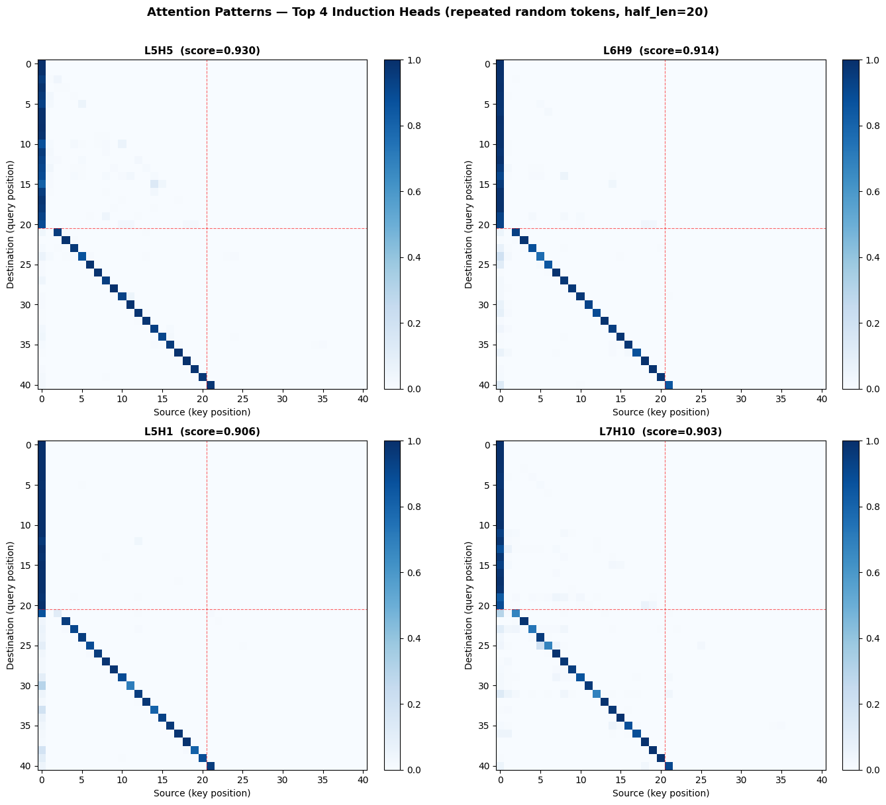

# Induction Head Replication in GPT-2 Small

**Replicating the induction head mechanism from Anthropic's *"A Mathematical Framework for Transformer Circuits"* using TransformerLens.**

This project identifies and characterizes induction heads in GPT-2 Small through systematic attention pattern analysis, synthetic repeated-token experiments, and per-head induction scoring — providing empirical evidence that specific attention heads in layers 5–11 implement the `[A][B]…[A] → [B]` pattern-completion circuit described in the foundational mechanistic interpretability literature.

> **Note:** All notebooks are pre-executed with full outputs (figures, tables, printed results) already embedded. You can review the complete analysis directly on GitHub without running any code. To reproduce the results interactively, use the "Open in Colab" buttons below.

---

## Key Findings

| Finding | Empirical Result |
|---|---|
| **Induction heads detected** | **12 heads** score above the 0.4 induction threshold out of 144 total heads |
| **Top 5 heads** | L5H5 (0.93), L6H9 (0.91), L5H1 (0.91), L7H10 (0.90), L7H2 (0.83) |
| **Score robustness** | All top-5 heads have σ < 0.02 across 30 independent random sequences |
| **Literature agreement** | **100% recall** — all 5 published induction heads recovered |
| **Score distribution** | Strongly bimodal — clean separation between induction and non-induction heads |
| **Layer distribution** | Primary cluster in layers 5–7; secondary cluster in layers 9–11 |
| **Composition evidence** | Previous-token and induction heads occupy distinct quadrants in the function space scatter plot — no head scores high on both axes |

---

## Quick Start

```bash
# Clone the repository
git clone https://github.com/enekomtz1/induction-head-replication.git
cd induction-head-replication

# Create and activate a virtual environment
python -m venv .venv
source .venv/bin/activate  # Linux/macOS
# .venv\Scripts\activate   # Windows

# Install dependencies
pip install -r requirements.txt

# Launch Jupyter and run notebooks in order
jupyter notebook
```

**Requirements:** Python 3.10+, ~500 MB disk for GPT-2 Small weights (downloaded on first run). GPU optional — all experiments run on CPU in under 15 minutes.

---

## Notebooks

Each notebook is self-contained and runs independently in Google Colab. Click the badges to open them directly:

| # | Notebook | Open in Colab | Purpose |
|---|----------|:---:|---------|
| 01 | `01_setup_and_model_loading.ipynb` | [](https://colab.research.google.com/github/enekomtz1/induction-head-replication/blob/main/01_setup_and_model_loading.ipynb) | Load GPT-2 Small via TransformerLens, inspect architecture (12L × 12H × 64d), verify hook-based cache access, visualize baseline attention patterns, sanity-check predictions |
| 02 | `02_experiment_induction_heads.ipynb` | [](https://colab.research.google.com/github/enekomtz1/induction-head-replication/blob/main/02_experiment_induction_heads.ipynb) | Generate synthetic repeated-token sequences, compute per-head induction scores across 30 random runs, visualize attention patterns of top heads, detect previous-token heads |
| 03 | `03_results_and_analysis.ipynb` | [](https://colab.research.google.com/github/enekomtz1/induction-head-replication/blob/main/03_results_and_analysis.ipynb) | Consolidated results with heatmaps, score distribution analysis, literature comparison table, composition scatter plot, limitations and future work discussion |

---

## Project Structure

```
induction-head-replication/
├── README.md
├── requirements.txt
├── .gitignore
├── 01_setup_and_model_loading.ipynb       # Environment validation + model exploration
├── 02_experiment_induction_heads.ipynb     # Core induction head detection pipeline
├── 03_results_and_analysis.ipynb          # Consolidated results + interpretation
├── figures/                                # Generated visualizations
│   ├── baseline_attention_patterns.png
│   ├── induction_scores_single.png
│   ├── induction_scores_bar_chart.png
│   ├── induction_head_attention_pattern.png
│   ├── prev_token_scores.png
│   ├── induction_score_heatmap.png
│   ├── induction_score_distribution.png
│   └── composition_scatter.png
```

---

## Methodology

The induction head detection pipeline follows four stages:

**1. Synthetic sequence generation** — Construct sequences of the form `[BOS, A₁ A₂ … Aₙ, A₁ A₂ … Aₙ]` where the second half repeats the first (`half_len = 50` tokens). This isolates the induction mechanism from natural language statistics — the only useful pattern-completion strategy is to attend to what followed the previous occurrence of the current token.

**2. Cached forward pass** — Run `model.run_with_cache()` to capture all 144 attention pattern tensors (12 layers × 12 heads) without modifying the computation graph. Each tensor has shape `[batch, n_heads, seq_len, seq_len]`.

**3. Induction score computation** — For each head, measure the average attention weight placed on the induction-relevant position: given query position `i` in the second half, this is position `i − half_len + 1` (the token *after* the first occurrence of the current token). Scores are averaged over 30 independent random sequences to ensure statistical robustness (σ < 0.02 for all top-5 heads).

**4. Visualization and validation** — Plot attention heatmaps for the top-scoring heads confirming the characteristic off-diagonal stripe, compare identified heads against published literature (100% recall), and analyse the composition relationship between previous-token heads and induction heads.

---

## Results in Detail

### Induction Score Ranking

The top 12 heads exceed the 0.4 induction threshold. The top 5 all belong to layers 5–7:

| Rank | Head | Mean Score | ± Std | Published |
|------|------|-----------|-------|-----------|
| 1 | **L5H5** | 0.9302 | 0.0148 | ✓ |
| 2 | **L6H9** | 0.9139 | 0.0197 | ✓ |
| 3 | **L5H1** | 0.9062 | 0.0192 | ✓ |
| 4 | **L7H10** | 0.9031 | 0.0185 | ✓ |
| 5 | **L7H2** | 0.8319 | 0.0192 | ✓ |
| 6 | L9H6 | 0.5175 | 0.0302 | — |
| 7 | L10H1 | 0.5135 | 0.0375 | — |
| 8 | L9H9 | 0.4910 | 0.0296 | — |
| 9 | L10H7 | 0.4757 | 0.0478 | — |
| 10 | L5H0 | 0.4696 | 0.0522 | — |
| 11 | L11H10 | 0.4379 | 0.0470 | — |
| 12 | L10H0 | 0.4062 | 0.0253 | — |

All 5 heads reported in Elhage et al. (2021) and Nanda's analyses are recovered (**100% recall**). The 7 additional heads we detect implement weaker or context-dependent induction that prior work chose not to highlight.



### Score Distribution

The induction score histogram shows a strongly **bimodal distribution**: most heads cluster near zero, while a distinct group separates above 0.4. The sorted-score curve shows a sharp elbow, with confidence bands confirming the gap is statistically robust.



### Composition: Previous-Token + Induction Circuit

The scatter plot of previous-token score vs. induction score reveals three distinct clusters: (1) early-layer previous-token heads providing positional signal, (2) middle-layer induction heads consuming that signal, and (3) the majority of heads serving unrelated functions. No head scores high on *both* axes — confirming the induction mechanism requires cross-layer composition, not a single head.



### Attention Patterns — Top Induction Heads

The top 4 heads display the characteristic off-diagonal induction stripe on repeated random token sequences:



---

## Background

**Induction heads** are a fundamental circuit in transformer language models. They implement in-context pattern completion: given a sequence where token `A` is followed by token `B` earlier in context, the head predicts `B` when `A` appears again.

The mechanism requires two components working in composition:

- **Previous-token head (early layer):** Attends to position `i−1`, writing positional offset information into the residual stream.
- **Induction head (later layer):** Reads the positional signal via its key matrix (K-composition), attends to the token *after* the previous occurrence of the current token, and copies that token's identity to boost the correct prediction.

This project provides empirical evidence for both components in GPT-2 Small, consistent with the original two-layer circuit model.

---

## Environment

These experiments were run with the following stack:

| Component | Version |
|---|---|
| Python | 3.12.13 |
| PyTorch | 2.10.0 (CPU) |
| TransformerLens | 2.18.0 |
| NumPy | 1.26.4 |
| Platform | Google Colab |

---

## Limitations and Future Work

**Limitations:** (1) Synthetic random-token data only — natural language may elicit different head behaviours. (2) The 0.4 threshold is a heuristic without formal statistical testing. (3) Correlational scores, not causal — ablation or activation patching needed to confirm necessity. (4) Single model — universality across architectures not tested.

**Extensions:** Activation patching to establish causal necessity, QK/OV circuit decomposition to verify the compositional mechanism, natural-language evaluation of in-context learning, and cross-model comparison on GPT-2 Medium/Large and Pythia.

---

## References

1. Elhage, N., Nanda, N., et al. (2021). *A Mathematical Framework for Transformer Circuits.* Anthropic. [transformer-circuits.pub/2021/framework](https://transformer-circuits.pub/2021/framework/index.html)

2. Olsson, C., Elhage, N., Nanda, N., et al. (2022). *In-context Learning and Induction Heads.* Anthropic. [transformer-circuits.pub/2022/in-context-learning-and-induction-heads](https://transformer-circuits.pub/2022/in-context-learning-and-induction-heads/index.html)

3. Nanda, N. (2023). *Exploratory Analysis Demo — TransformerLens.* [neelnanda.io/exploratory-analysis-demo](https://neelnanda.io/exploratory-analysis-demo)

4. McDougall, C. (2024). *ARENA Chapter 1: Transformer Interpretability.* [arena3-chapter1-transformer-interp.streamlit.app](https://arena3-chapter1-transformer-interp.streamlit.app/)

5. TransformerLens Library. [github.com/TransformerLensOrg/TransformerLens](https://github.com/TransformerLensOrg/TransformerLens)

---

## License

MIT

---

## Author

**Eneko Martínez** — [enekomartinez.com](https://www.enekomartinez.com/) · [github.com/enekomtz1](https://github.com/enekomtz1) · [linkedin.com/in/enekomtz](https://linkedin.com/in/enekomtz/)
